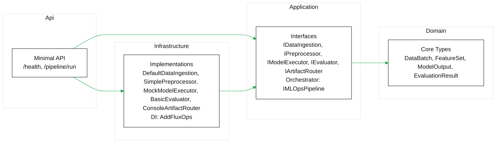

# FluxOps-dotNet

A clean, extensible, cloud-ready .NET 8 implementation of a modular MLOps pipeline inspired by the Python FluxOps project. It demonstrates end-to-end orchestration, automation, and reproducible workflow design across data ingestion, preprocessing, model execution, evaluation, and artifact handling.

## Architecture

- **Domain**: Core domain types (`DataBatch`, `FeatureSet`, `ModelOutput`, `EvaluationResult`). No external dependencies.
- **Application**: Pipeline contracts and orchestrator (`IMLOpsPipeline`, `IDataIngestion`, `IPreprocessor`, `IModelExecutor`, `IEvaluator`, `IArtifactRouter`, `PipelineOptions`). Pure interfaces + coordination.
- **Infrastructure**: Default implementations and DI registration (`AddFluxOps`). Includes:
  - Ingestion: `DefaultDataIngestion` (Inline and LocalFile)
  - Preprocessing: `SimplePreprocessor`
  - Model: `MockModelExecutor`
  - Evaluation: `BasicEvaluator`
  - Artifacts: `ConsoleArtifactRouter`
- **Api**: Minimal API exposing HTTP endpoints and wiring configuration/logging.
- **Tests**: xUnit project validating the pipeline orchestration.

Clean architecture dependencies:
- Api → Application, Infrastructure
- Infrastructure → Application, Domain
- Application → Domain
- Domain → (none)

### Architecture Diagram (Mermaid)



## Pipeline Flow

1. Ingestion pulls raw data (`IngestionSpec`) → `DataBatch`
2. Preprocessor converts records → `FeatureSet`
3. Model executor runs model → `ModelOutput`
4. Evaluator computes metrics → `EvaluationResult`
5. Artifact router logs/ships artifacts (enabled via `Pipeline.EnableArtifactRouting`)

All stages are async and interface-driven, so each is independently testable and replaceable.

### Pipeline Flow Diagram (Mermaid)

```mermaid
%%{init: {"theme": "base", "themeVariables": {"background": "#ffffff", "textColor": "#111111", "primaryTextColor": "#111111", "secondaryTextColor": "#111111", "tertiaryTextColor": "#111111", "primaryColor": "#ffffff", "lineColor": "#16a34a", "nodeBorder": "#111111"}, "flowchart": {"htmlLabels": false} } }%%
flowchart TD
    Ingest["Data Ingestion\nInline &#124; LocalFile &#124; Cloud &#124; Event"] --> Pre["Preprocessing\nFeature Extraction"]
    Pre --> Exec["Model Execution\nMockModelExecutor"]
    Exec --> Eval["Evaluation\nMetrics"]
    Eval --> Artifacts["Artifact Routing\nConsole / Storage"]
    classDef stage fill:#eef,stroke:#16a34a,stroke-width:1px;
    class Ingest,Pre,Exec,Eval,Artifacts stage;
```



## Minimal API vs Azure Functions

- **Minimal API (chosen)**: Simple to run locally and in containers; full control over host, DI, and middleware; straightforward for synchronous pipeline orchestration.
- **Azure Functions**: Great for event-driven/serverless workloads, autoscaling, and binding to triggers (queues, blobs). Adds host constraints and function app packaging. You can migrate later by reusing Application + Domain and swapping Api for Functions bindings.

## Getting Started

Prerequisites: .NET SDK 8 (pinned via `global.json`).

### Build & Test

```bash
cd fluxOps-dotNet
dotnet build FluxOps.DotNet.sln
dotnet test FluxOps.DotNet.sln
```

### Run the API

```bash
cd FluxOps.Api
dotnet run
```

Endpoints:
- `GET /health` → simple health status
- `POST /pipeline/run` → runs the pipeline using JSON body:

```json
{
  "sourceType": "Inline",
  "payload": ["abc", "defgh"]
}
```

You can also run with a local file:

```json
{
  "sourceType": "LocalFile",
  "pathOrUri": "D:/data/sample.txt"
}
```

### Configuration

`FluxOps.Api/appsettings.json` contains:

```json
{
  "Logging": { "LogLevel": { "Default": "Information" } },
  "AllowedHosts": "*",
  "Pipeline": { "EnableArtifactRouting": true }
}
```

`Pipeline` binds to `PipelineOptions` to toggle artifact routing and future settings.

## Extensibility & Cloud Readiness

- **Modularity**: Each stage is defined by interfaces; swap implementations without touching orchestrator.
- **Testability**: Mock any stage to unit-test the pipeline or a single component.
- **Multi-model/pipelines**: Add new `IModelExecutor` implementations and route via configuration or composition; orchestrate multiple pipelines by composing different stage sets.
- **Cloud deployment**: Containerize the Minimal API; DI and configuration are environment-friendly. For serverless/event-driven, replace Api with Azure Functions and reuse Application/Domain.
- **Async-first**: All stages use `async/await` for scalability.

## Solution Structure

```
FluxOps.DotNet.sln
FluxOps.Domain/
FluxOps.Application/
FluxOps.Infrastructure/
FluxOps.Api/
FluxOps.Tests/
```

## Notes

- XML documentation comments are included on public classes and methods to aid tooling and API docs.
- Logging via `Microsoft.Extensions.Logging` is wired throughout; replace the artifact router with storage sinks (e.g., blobs, queues) as needed.
