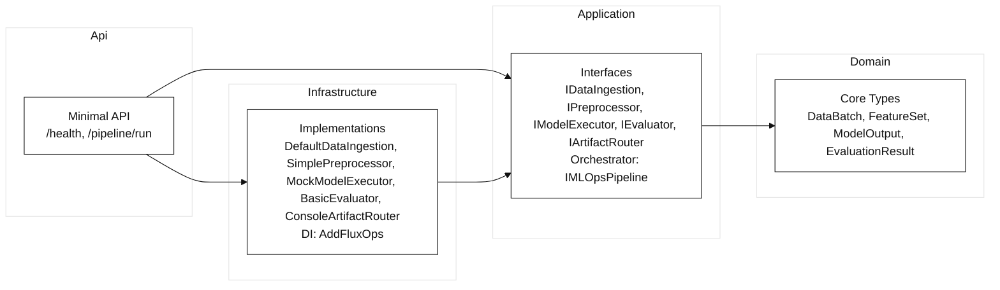

```mermaid
%%{init: {"theme": "base", "themeVariables": {"background": "#ffffff", "textColor": "#111111", "primaryTextColor": "#111111", "secondaryTextColor": "#111111", "tertiaryTextColor": "#111111", "primaryColor": "#ffffff", "lineColor": "#111111", "nodeBorder": "#111111"}, "flowchart": {"htmlLabels": false} } }%%
flowchart LR
    subgraph Domain
        D[Core Types\nDataBatch, FeatureSet, ModelOutput, EvaluationResult]
    end
    subgraph Application
        A[Interfaces\nIDataIngestion, IPreprocessor, IModelExecutor, IEvaluator, IArtifactRouter\nOrchestrator: IMLOpsPipeline]
    end
    subgraph Infrastructure
        I[Implementations\nDefaultDataIngestion, SimplePreprocessor, MockModelExecutor, BasicEvaluator, ConsoleArtifactRouter\nDI: AddFluxOps]
    end
    subgraph Api
        P[Minimal API\n/health, /pipeline/run]
    end

    P --> A
    P --> I
    I --> A
    A --> D
```
