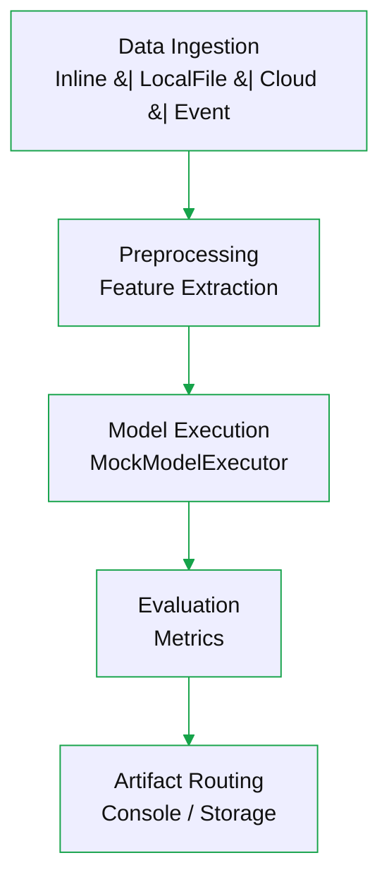

```mermaid
%%{init: {"theme": "base", "themeVariables": {"background": "#ffffff", "textColor": "#111111", "primaryTextColor": "#111111", "secondaryTextColor": "#111111", "tertiaryTextColor": "#111111", "primaryColor": "#ffffff", "lineColor": "#16a34a", "nodeBorder": "#111111"}, "flowchart": {"htmlLabels": false} } }%%
flowchart TD
    Ingest["Data Ingestion\nInline &#124; LocalFile &#124; Cloud &#124; Event"] --> Pre["Preprocessing\nFeature Extraction"]
    Pre --> Exec["Model Execution\nMockModelExecutor"]
    Exec --> Eval["Evaluation\nMetrics"]
    Eval --> Artifacts["Artifact Routing\nConsole / Storage"]
    classDef stage fill:#eef,stroke:#16a34a,stroke-width:1px;
    class Ingest,Pre,Exec,Eval,Artifacts stage;
```
